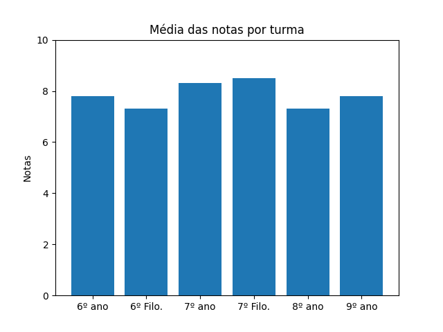

# 📘 Projeto: Média de Notas dos Alunos

Este projeto em **Python** tem como objetivo calcular a **média de notas
dos alunos** do 6º ao 9º ano nas matérias de Informática e Ética do **CECF - Centro Educacional Criança Feliz**.\
Ele pode ser utilizado como ferramenta de apoio educacional para
professores, estudantes ou qualquer pessoa que precise gerenciar notas
de forma simples e rápida.

------------------------------------------------------------------------

## 📌 Funcionalidades

-   Inserção de notas de várias matérias.\
-   Cálculo automático da média do aluno.\
-   Exibição do resultado final (aprovado ou reprovado).\
-   Estrutura de código simples, didática e de fácil manutenção.

------------------------------------------------------------------------

## 🖼️ Demonstração

Aqui você pode adicionar uma imagem ou captura de tela do programa em
execução:




------------------------------------------------------------------------

## 🛠️ Tecnologias Utilizadas

-   **Python 3.x**

------------------------------------------------------------------------

## 📂 Estrutura do Projeto

    projeto-media-notas/
    │-- main.py        # Arquivo principal com a lógica do programa
    │-- README.md      # Documentação do projeto
    │-- assets/        # Pasta para imagens/demonstrações

------------------------------------------------------------------------

## 🚀 Como Executar

1.  Clone este repositório:

    ``` bash
    git clone hthttps://github.com/Fariaslr/GraphicBar.git
    ```

2.  Acesse a pasta do projeto:

    ``` bash
    cd GraphicBar
    ```

3.  Execute o programa:

    ``` bash
    python main.py
    ```

------------------------------------------------------------------------

## 📜 Licença

Este projeto está sob a licença MIT. Sinta-se livre para usar e
modificar.

------------------------------------------------------------------------

## ✨ Autor

Desenvolvido por **Lucas R. Farias** 👨‍💻
